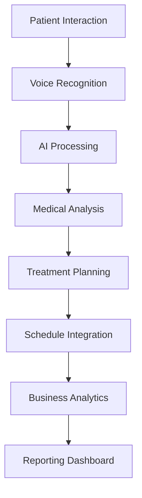

# 🏗️ MedicalCor GENIUS 2.0 - Arhitectură Modulară

## 🚀 Viziune Tehnologică

MedicalCor GENIUS 2.0 este primul AI Operating System dedicat clinicilor stomatologice, construit pe o arhitectură modulară state-of-the-art care combină microservicii, AI/ML, și interfețe vocale avansate.

## 📐 Arhitectura Generală

### 🏢 Structura Modulară (Microservicii)

```
┌─────────────────────────────────────────────────────────────────────┐
│                    MEDICALCOR GENIUS 2.0                           │
│                   AI OPERATING SYSTEM                              │
└─────────────────────────────────────────────────────────────────────┘
│
├── 🧠 AI CORE ENGINE
│   ├── Neural Network Orchestrator
│   ├── ML/CV Processing Pipeline
│   ├── Voice Recognition & Synthesis
│   └── Predictive Analytics Engine
│
├── 🔬 MEDICAL MODULES
│   ├── Diagnostic AI Assistant
│   ├── Treatment Planning Engine
│   ├── Patient Management System
│   ├── Laboratory Integration Hub
│   └── Inventory Intelligence
│
├── 💼 BUSINESS INTELLIGENCE
│   ├── CFO Dashboard & Analytics
│   ├── Marketing Automation
│   ├── Revenue Optimization
│   └── Performance Metrics
│
├── 🌐 INTEGRATION LAYER
│   ├── API Gateway & Management
│   ├── Third-party Connectors
│   ├── Legacy System Bridges
│   └── Cloud Services Interface
│
└── 🛡️ SECURITY & COMPLIANCE
    ├── GDPR Compliance Engine
    ├── Medical Data Protection
    ├── Audit Trail System
    └── Access Control Matrix
```

## 🛠️ Stack Tehnologic Recomandat

### 🎯 Frontend (React Ecosystem)
- **Framework**: React 18+ cu TypeScript
- **State Management**: Zustand + React Query
- **UI Components**: Shadcn/ui + Custom Glass Morphism
- **Styling**: Tailwind CSS + CSS Variables
- **Animations**: Framer Motion + Custom CSS Keyframes
- **Voice Interface**: Web Speech API + ElevenLabs

### ⚙️ Backend (Microservices)
- **Runtime**: Node.js 20+ / Deno Fresh
- **API Gateway**: Kong / Supabase Edge Functions
- **Database**: PostgreSQL + Supabase
- **Cache**: Redis / Upstash
- **Message Queue**: RabbitMQ / Supabase Realtime
- **File Storage**: Supabase Storage / AWS S3

### 🧠 AI/ML Infrastructure
- **ML Framework**: TensorFlow.js / PyTorch
- **Computer Vision**: OpenCV + Custom Models
- **NLP**: OpenAI GPT-4 + Custom Fine-tuning
- **Voice Processing**: Whisper API + ElevenLabs
- **Model Serving**: TensorFlow Serving / Hugging Face

### ☁️ Cloud & DevOps
- **Container**: Docker + Kubernetes
- **CI/CD**: GitHub Actions + Vercel
- **Monitoring**: Sentry + Datadog
- **Infrastructure**: Supabase + Vercel + AWS
- **CDN**: Cloudflare

## 🏗️ Microservicii Detaliate

### 1. 🧠 AI Core Engine
```typescript
// Neural Network Orchestrator
interface AIOrchestrator {
  processVoiceCommand(audio: AudioBuffer): Promise<AIResponse>
  analyzeImage(image: ImageData): Promise<DiagnosticResult>
  predictTreatment(patientData: PatientProfile): Promise<TreatmentPlan>
  optimizeSchedule(appointments: Appointment[]): Promise<Schedule>
}

// Endpoints
POST /api/ai/voice/process
POST /api/ai/vision/analyze
POST /api/ai/treatment/predict
POST /api/ai/schedule/optimize
```

### 2. 🔬 Medical Modules
```typescript
// Diagnostic AI Assistant
interface DiagnosticEngine {
  analyzeCBCT(scan: CBCTData): Promise<DiagnosticReport>
  detectAnomalies(xray: XRayImage): Promise<AnomalyDetection>
  generateReport(findings: DiagnosticFindings): Promise<MedicalReport>
}

// Treatment Planning
interface TreatmentPlanner {
  createPlan(diagnosis: Diagnosis): Promise<TreatmentPlan>
  calculateCost(plan: TreatmentPlan): Promise<CostEstimate>
  schedulePhases(plan: TreatmentPlan): Promise<Timeline>
}
```

### 3. 💼 Business Intelligence
```typescript
// CFO Dashboard
interface BusinessAnalytics {
  generateKPIs(period: DateRange): Promise<KPIMetrics>
  predictRevenue(months: number): Promise<RevenueProjection>
  analyzePatientSegments(): Promise<PatientSegmentation>
  optimizePricing(services: Service[]): Promise<PricingStrategy>
}

// Marketing Automation
interface MarketingEngine {
  segmentPatients(criteria: SegmentationCriteria): Promise<PatientSegments>
  generateCampaigns(segments: PatientSegments): Promise<Campaign[]>
  trackConversions(campaign: Campaign): Promise<ConversionMetrics>
}
```

### 4. 🌐 Integration Layer
```typescript
// API Gateway Configuration
interface APIGateway {
  rateLimiting: RateLimitConfig
  authentication: AuthConfig
  monitoring: MonitoringConfig
  routing: RouteConfig[]
}

// Third-party Integrations
interface IntegrationHub {
  iStoma: IStomaConnector
  zapier: ZapierConnector
  discord: DiscordConnector
  notion: NotionConnector
  clickup: ClickUpConnector
}
```

## 🔄 Fluxuri de Date

### 📊 Patient Data Flow


### 🎯 Real-time Processing
```typescript
// WebSocket Connections
interface RealtimeConnections {
  voiceCommands: WebSocket
  diagnosticUpdates: WebSocket
  scheduleChanges: WebSocket
  systemAlerts: WebSocket
}

// Event Streaming
interface EventBus {
  publish(event: MedicalEvent): void
  subscribe(eventType: string, handler: EventHandler): void
  unsubscribe(subscription: Subscription): void
}
```

## 🔒 Securitate & Compliance

### 🛡️ Măsuri de Securitate
```typescript
interface SecurityLayer {
  encryption: {
    algorithm: 'AES-256-GCM'
    keyRotation: 'monthly'
    certificates: 'TLS 1.3'
  }
  
  authentication: {
    method: 'JWT + Refresh Tokens'
    mfa: 'TOTP + Biometric'
    sessionTimeout: '15 minutes'
  }
  
  authorization: {
    model: 'RBAC + ABAC'
    permissions: 'Fine-grained'
    audit: 'Complete trail'
  }
}
```

### 📋 Compliance GDPR
```typescript
interface GDPRCompliance {
  dataMinimization: boolean
  consentManagement: ConsentSystem
  rightToErasure: ErasureSystem
  dataPortability: ExportSystem
  auditLogging: AuditSystem
}
```

## 📈 Scalabilitate & Performance

### ⚡ Optimizări Performance
- **Lazy Loading**: Componente și rute
- **Code Splitting**: Bundle optimization
- **CDN**: Asset delivery
- **Caching**: Multi-level strategy
- **Database**: Query optimization + Indexing

### 📊 Metrici de Performanță
```typescript
interface PerformanceMetrics {
  loadTime: '<2 seconds'
  apiResponse: '<500ms'
  voiceProcessing: '<1 second'
  imageAnalysis: '<3 seconds'
  uptime: '99.9%'
}
```

## 🔧 Configurare & Deployment

### 🚀 Deployment Strategy
```yaml
# Docker Compose Example
version: '3.8'
services:
  frontend:
    image: medicalcor/frontend:latest
    ports: ['3000:3000']
    
  api-gateway:
    image: medicalcor/gateway:latest
    ports: ['8080:8080']
    
  ai-engine:
    image: medicalcor/ai-engine:latest
    environment:
      - OPENAI_API_KEY=${OPENAI_API_KEY}
      - ELEVENLABS_API_KEY=${ELEVENLABS_API_KEY}
    
  database:
    image: postgres:16
    environment:
      - POSTGRES_DB=medicalcor
      - POSTGRES_USER=${DB_USER}
      - POSTGRES_PASSWORD=${DB_PASSWORD}
```

### 🌍 Multi-tenant Architecture
```typescript
interface TenantConfig {
  clinicId: string
  subdomain: string
  customBranding: BrandingConfig
  features: FeatureSet
  limits: UsageLimits
}
```

## 🎯 Roadmap Tehnologic

### Q1 2025: Foundation
- ✅ Core AI Engine
- ✅ Voice Interface
- ✅ Basic Medical Modules

### Q2 2025: Enhancement
- 🔄 Advanced ML Models
- 🔄 Real-time Collaboration
- 🔄 Mobile Applications

### Q3 2025: Expansion
- 🔄 International Scaling
- 🔄 Advanced Analytics
- 🔄 IoT Integration

### Q4 2025: Innovation
- 🔄 AR/VR Integration
- 🔄 Blockchain Health Records
- 🔄 Advanced AI Agents

---

**🌟 MedicalCor GENIUS 2.0 - Transformând viitorul medicinei dentare prin tehnologie de vârf!**