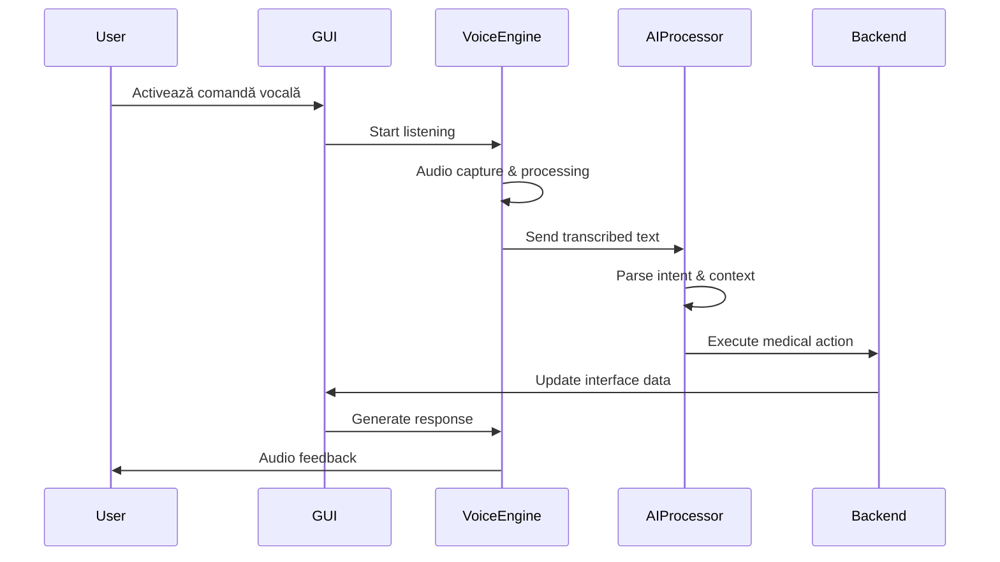

# 🎤 MedicalCor GENIUS 2.0 - Flux Vocal + GUI

## 🌟 Viziune: Interfața Vocală Revoluționară

Prima interfață vocală medicală completă din lume, integrată seamless cu GUI-ul pentru experiența supremă în medicina dentară.

## 🎯 Arhitectura Vocală

### 🔊 Pipeline Voice Processing

```
┌─────────────────────────────────────────────────────────────────────┐
│                    VOICE PROCESSING PIPELINE                        │
└─────────────────────────────────────────────────────────────────────┘
│
├── 🎤 VOICE INPUT
│   ├── Microphone Capture (Web Audio API)
│   ├── Noise Cancellation (WebRTC)
│   ├── Voice Activity Detection
│   └── Audio Buffer Management
│
├── 🧠 SPEECH RECOGNITION
│   ├── OpenAI Whisper API
│   ├── Real-time Streaming
│   ├── Multi-language Support (RO/EN)
│   └── Medical Terminology Training
│
├── 🤖 AI PROCESSING
│   ├── Natural Language Understanding
│   ├── Intent Recognition
│   ├── Context Awareness
│   └── Medical Command Parsing
│
├── 💬 RESPONSE GENERATION
│   ├── GPT-4 Medical Assistant
│   ├── Contextual Responses
│   ├── Professional Medical Language
│   └── Action Recommendations
│
└── 🔊 VOICE OUTPUT
    ├── ElevenLabs TTS
    ├── Natural Romanian Voice
    ├── Medical Pronunciation
    └── Real-time Synthesis
```

## 🎨 GUI + Voice Integration Design

### 🖥️ Visual Voice Interface

```typescript
interface VoiceGUIState {
  // Voice Status
  isListening: boolean
  isProcessing: boolean
  isSpeaking: boolean
  
  // Visual Feedback
  waveformData: Float32Array
  confidenceLevel: number
  recognizedText: string
  
  // Context Awareness
  currentScreen: string
  activePatient: PatientData
  availableCommands: VoiceCommand[]
}

// Voice Commands per Module
interface VoiceCommandMap {
  dashboard: [
    "Arată-mi programările de astăzi",
    "Care sunt pacienții noi?",
    "Generează raportul săptămânal",
    "Deschide fișa pacientului [nume]"
  ]
  
  diagnostic: [
    "Analizează această radiografie",
    "Generează planul de tratament",
    "Calculează costurile",
    "Trimite raportul la laborator"
  ]
  
  scheduling: [
    "Programează pacientul pentru [data]",
    "Găsește următorul slot liber",
    "Mută programarea cu o oră",
    "Trimite reminder SMS"
  ]
  
  financial: [
    "Arată-mi KPI-urile lunii",
    "Calculează profitul net",
    "Generează factura pentru [pacient]",
    "Prezintă analiza cash flow"
  ]
}
```

### 🎪 Componente Interactive Vocale

#### 1. 🎤 Voice Status Indicator
```tsx
interface VoiceIndicatorProps {
  status: 'idle' | 'listening' | 'processing' | 'speaking'
  confidence: number
  waveform: Float32Array
}

const VoiceIndicator: React.FC<VoiceIndicatorProps> = ({ 
  status, confidence, waveform 
}) => (
  <div className="neuro-card quantum-glow">
    {/* Neural Waveform Visualization */}
    <div className="voice-waveform animate-neural-pulse">
      {waveform.map((amplitude, i) => (
        <div 
          key={i}
          className="waveform-bar"
          style={{ 
            height: `${amplitude * 100}%`,
            background: 'var(--gradient-holographic)'
          }}
        />
      ))}
    </div>
    
    {/* Status Display */}
    <div className="voice-status">
      <div className={`status-icon ${status}`}>
        {status === 'listening' && <Mic className="animate-vital-pulse" />}
        {status === 'processing' && <Brain className="animate-neural-pulse" />}
        {status === 'speaking' && <Volume2 className="animate-glow-pulse" />}
      </div>
      
      <div className="confidence-meter">
        <div 
          className="confidence-bar bg-gradient-primary"
          style={{ width: `${confidence * 100}%` }}
        />
      </div>
    </div>
  </div>
)
```

#### 2. 🗣️ Voice Command Suggestions
```tsx
const VoiceCommandSuggestions: React.FC = () => {
  const [currentCommands, setCurrentCommands] = useState<string[]>([])
  
  return (
    <div className="glass-card hover-quantum">
      <h3 className="text-holographic mb-4">Comenzi Disponibile</h3>
      
      <div className="command-grid">
        {currentCommands.map((command, index) => (
          <button
            key={index}
            className="btn-quantum ai-indicator animate-fade-in"
            style={{ animationDelay: `${index * 0.1}s` }}
            onClick={() => executeVoiceCommand(command)}
          >
            <MessageSquare className="w-4 h-4 mr-2" />
            "{command}"
          </button>
        ))}
      </div>
    </div>
  )
}
```

#### 3. 🎯 Context-Aware Voice Actions
```tsx
interface VoiceContextProps {
  currentModule: string
  patientContext?: PatientData
  diagnosticContext?: DiagnosticData
}

const VoiceContextActions: React.FC<VoiceContextProps> = ({
  currentModule, patientContext, diagnosticContext
}) => {
  const getContextualCommands = () => {
    switch (currentModule) {
      case 'patient':
        return [
          `Deschide fișa pentru ${patientContext?.name}`,
          "Adaugă notă la tratament",
          "Programează următoarea vizită",
          "Generează scrisoare medicală"
        ]
      
      case 'diagnostic':
        return [
          "Analizează imaginea cu AI",
          "Compară cu cazuri similare",
          "Sugerează tratamentul optim",
          "Calculează probabilitatea de succes"
        ]
      
      default:
        return [
          "Navigare vocală activă",
          "Ajutor comenzi vocale",
          "Setări personalizare voce"
        ]
    }
  }
  
  return (
    <div className="ai-card neural-pulse">
      <div className="context-header text-neural">
        <Activity className="w-5 h-5 animate-heartbeat" />
        Context: {currentModule.toUpperCase()}
      </div>
      
      {getContextualCommands().map(command => (
        <VoiceActionButton key={command} command={command} />
      ))}
    </div>
  )
}
```

## 🔄 Fluxuri de Interacțiune

### 📱 Flux Principal Voice + GUI



### 🎯 Scenarii de Utilizare Avansate

#### 1. 📋 Completare Fișă Pacient Vocală
```typescript
// Scenario: Doctor completează fișa în timpul consultației
const VocalPatientForm = {
  trigger: "Completez fișa pentru pacientul [nume]",
  
  flow: [
    {
      step: "identification",
      voice: "Confirmați numele pacientului",
      gui: "Highlight patient card",
      validation: "Name matching + confirmation"
    },
    {
      step: "symptoms",
      voice: "Descrieți simptomele observate",
      gui: "Visual symptom selector",
      ai: "Medical terminology recognition"
    },
    {
      step: "diagnosis",
      voice: "Anunțați diagnosticul preliminar",
      gui: "ICD codes suggestions",
      ai: "Diagnosis validation & recommendations"
    },
    {
      step: "treatment",
      voice: "Specificați planul de tratament",
      gui: "Treatment timeline visualization",
      ai: "Cost calculation & scheduling"
    }
  ]
}
```

#### 2. 🔬 Analiză Radiografie Vocală
```typescript
const VocalImageAnalysis = {
  trigger: "Analizează această radiografie",
  
  flow: [
    {
      step: "image_selection",
      voice: "Selectați imaginea pentru analiză",
      gui: "Image gallery with vocal navigation",
      ai: "Image recognition & metadata extraction"
    },
    {
      step: "ai_analysis",
      voice: "AI analizează imaginea...",
      gui: "Neural processing visualization",
      ai: "Computer vision analysis + annotations"
    },
    {
      step: "results_review",
      voice: "Prezint rezultatele analizei",
      gui: "Annotated image + findings panel",
      ai: "Confidence scores + recommendations"
    },
    {
      step: "action_planning",
      voice: "Recomand următorii pași",
      gui: "Action buttons + scheduling",
      ai: "Treatment pathway suggestions"
    }
  ]
}
```

#### 3. 📊 Generare Rapoarte Vocale
```typescript
const VocalReportGeneration = {
  trigger: "Generează raportul [perioada/tip]",
  
  flow: [
    {
      step: "parameters",
      voice: "Specificați parametrii raportului",
      gui: "Date pickers + filters visualization",
      ai: "Parameter validation + suggestions"
    },
    {
      step: "data_processing",
      voice: "Procesez datele...",
      gui: "Data processing animation",
      ai: "Analytics computation + insights"
    },
    {
      step: "visualization",
      voice: "Prezint rezultatele",
      gui: "Interactive charts + KPIs",
      ai: "Trend analysis + predictions"
    },
    {
      step: "export_options",
      voice: "Opțiuni de export disponibile",
      gui: "Export format selector",
      ai: "Format recommendations"
    }
  ]
}
```

## 🎨 Design Patterns Vocal-GUI

### 🔮 Quantum Voice Feedback
```scss
// Voice Status Animation Styles
.voice-status {
  &.listening {
    .status-ring {
      animation: neural-pulse 1.5s infinite;
      box-shadow: var(--shadow-holographic);
    }
  }
  
  &.processing {
    .status-ring {
      animation: quantum-rotate 2s linear infinite;
      background: var(--gradient-neural);
    }
  }
  
  &.speaking {
    .status-ring {
      animation: vital-pulse 0.8s infinite;
      background: var(--gradient-secondary);
    }
  }
}

// Waveform Visualization
.voice-waveform {
  display: flex;
  align-items: end;
  gap: 2px;
  height: 60px;
  
  .waveform-bar {
    min-width: 3px;
    background: var(--gradient-holographic);
    border-radius: 2px;
    transition: height 0.1s ease;
    animation: data-flow 0.3s ease-in-out;
  }
}
```

### 🧠 Neural Command Recognition
```typescript
interface NeuralCommandProcessor {
  // Context-aware command parsing
  parseCommand(audio: AudioBuffer, context: AppContext): Promise<{
    intent: MedicalIntent
    entities: MedicalEntity[]
    confidence: number
    suggestions: string[]
  }>
  
  // Predictive text completion
  predictCompletion(partialText: string): Promise<string[]>
  
  // Medical terminology validation
  validateMedicalTerms(text: string): Promise<{
    valid: boolean
    corrections: string[]
    alternatives: string[]
  }>
}
```

## 🎭 Personalizare Vocală

### 🎚️ Voice Personality Settings
```typescript
interface VoicePersonality {
  formality: 'casual' | 'professional' | 'academic'
  speed: 'slow' | 'normal' | 'fast'
  language: 'ro' | 'en' | 'mixed'
  medicalLevel: 'patient' | 'nurse' | 'doctor' | 'specialist'
  
  // Contextual responses
  greetings: string[]
  confirmations: string[]
  errors: string[]
  suggestions: string[]
}

const generateContextualResponse = (
  intent: string, 
  personality: VoicePersonality
): string => {
  // AI-generated responses based on personality
  return `Personalized response for ${intent}`
}
```

## 📊 Metrici Voice Performance

### ⚡ KPIs Vocale
```typescript
interface VoiceMetrics {
  recognition: {
    accuracy: number        // >95%
    latency: number        // <500ms
    noiseReduction: number // >80%
  }
  
  interaction: {
    commandSuccess: number     // >90%
    userSatisfaction: number   // >4.5/5
    timeToComplete: number     // <30s avg
  }
  
  medical: {
    terminologyAccuracy: number  // >98%
    clinicalContext: number      // >95%
    safetyValidation: number     // 100%
  }
}
```

---

**🎤 Viitorul interacțiunii medicale este vocal și inteligent!**